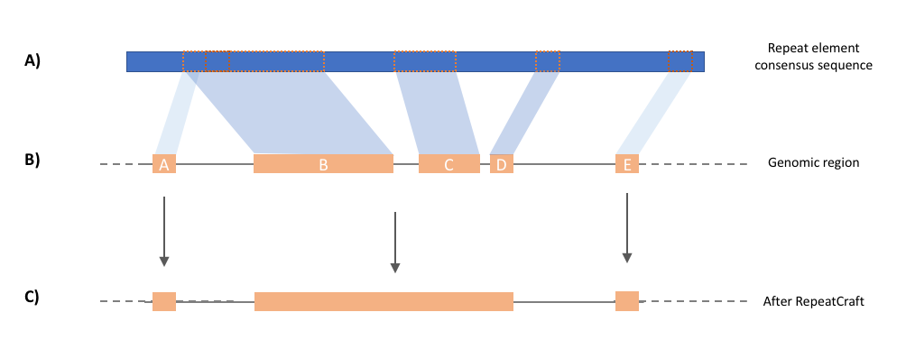

# RepeatCraft pipeline

#### Overview
RepeatCraft pipeline incorporates tools for repeat element classification based on both sequence similarity and structural features. The pipeline defragments closely spanced repeat loci in the genomes, reconstructing longer copies thus allowing for a better annotation and sequence comparisons. A Shiny web application is also developed as a user interface for the RepeatCraft pipeline, and it allows easy access and interactive study of repeat elements. The web server is available at [http://131.130.65.134:3838/repeatcraft](http://131.130.65.134:3838/repeatcraft). You can also run it on your machine by installing the repeatcraft R package [https://github.com/niccw/repeatCraft](https://github.com/niccw/repeatCraft).

#### What does RepeatCraft do?
##### 'Fragments' in repeat annotation

After the repeat-based repeat identification and annotation (i.e. RepeatModeler and RepeatMasker (Smit, 2013-2015)), fragments of repeats beloning to the same repeat family can be found in certain genomic region (for example: blcok b,c,d in track B). These repeats are closely spanced and non-overlap in the consensus sequence. Multiple counting of repeats may affect the result of downstream analysis (e.g. age estimation). Therefore, RepeatCraft is designed as a easy-to-use tool for mering repeat fragments. Group label are first added to the attribute field of repeats to be merge, then RepeatCraft will merge the repeat based on the group label and LTR label (see below).

##### Group repeats based on annotation from LTR_FINDER

LTR_FINDER (Xu and Wang, 2017) is a popular structural-based LTR (Long Tandem Repeat) identification tool. It identify the full-length LTR by searching structural features. Using the results from LTR_FINDER, RepeatCraft merge the LTR annotated in the RepeatMasker GFF (which belong to the same LTR subgroup) and decrease the degree of fragmentization. 


#### Run RepeatCraft
RepeatCraft can be ran by calling `repatcraft.py`, it takes the following arguments and options:
```
usage: repeatcraft.py [-h] [-r RMGFF] [-u RMOUT] [-c CONFIG] [-o OUTPUT]
                      [-m MERGE]

RepeatCraft pipeline for improving repeat elements annotationby defragments
closely spanced repeat elements,based on sequence similarity and structural
features from different annotators

optional arguments:
  -h, --help            show this help message and exit
  -r RMGFF, --rmgff RMGFF
                        RepeatMasker GFF
  -u RMOUT, --rmout RMOUT
                        RepeatMasker OUT
  -c CONFIG, --config CONFIG
                        Configuration file. Default = repeatcraft.cfg
  -o OUTPUT, --output OUTPUT
                        Output file name
  -m MERGE, --merge MERGE
                        Merge the GFF. Default = False, RepeatCraft will only
                        add LTRgroup and TEgroup label at theattribute column
```
Example run:
`./repeatcraft.py -r example_input.gff -u example_input.out -c repeatcraft.cfg -o example -m True`

###### Inputs
The example folder contains the sample inputs `example_input.gff` `example_input.out` (GFF and OUT files from RepeatMasker), the configuration file `repeatcraft.cfg` and the mapfile `mapfile.tsv`which is used in short TEs labelling. 

###### Outputs
By default, the merge flag is `False` and RepeatCraft would only add label to the attribute column, (example output: `example_rclabel.gff`). If `-m True`, the repeats will be merged based on the labels added in the previous two step (example output: `example_rmerge.gff`, and the strand (+/-) will follow the orientation of the largest repeat in the group.

Example run:
`./repeatcraft.py -r example_input.gff -u example_input.out -c repeatcraft.cfg -o example -m True`

##### Parameters in repeatcraft.cfg

